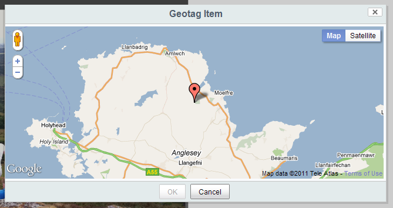
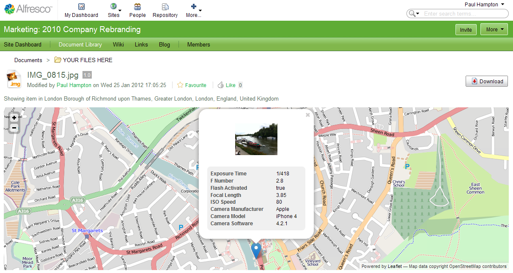

Geo Views add-on for Alfresco Share
===================================

Author: Will Abson

This project provides the following components which display geotagged content items within map views and to modify the geographic information associated with stored items.

By default Google Maps is used to render map views, with support for [Leaflet](http://leafletjs.com/) included via additional Share modules (requires Alfresco 4.0 or greater).

The add-on has been developed to install on top of an existing Alfresco 3.4 or 4.x installation. It can work with version 3.3 if the `cm:geographic` aspect is added to the repository's content model - see _Known Issues_ below.

### Site Geotagged Content Dashlet

This dashlet displays site content on a configurable map view on the site dashboard in Alfresco 3.3 or greater.
    

    
### Document Library 'Geographic' View

Allows the user to select a _Geographic_ view within the site Document Library itself. The map displays content in a specific folder or matching any of Share's predefined filters, using the map view.

This view relies on the new [pluggable view capabilities](http://rgauss.com/2012/08/08/adding-document-library-views-to-alfresco-share/) introduced in Alfresco 4.2, and therefore will not function in older versions of Alfresco.

###Document Details page Map Component

The add-on adds an additional page component for the Document Details page to display a small map view for geotagged content items. Works in Alfresco 3.3 and greater.
    

The page component will display automatically for content items which already have the _Geographic_ aspect applied to them. For other items, a custom Document library action named _Geotag_ is supplied, which can be enabled at install time.

### _Geotag_ Document Library Action

Allows users to add Geographic information to items, or to modify existing Geographic location data, using a map view.

This action is provided in the 0.x version and the 2.x version, providing support for Alfresco 3.3/3.4 and 4.x, respectively.

The 2.x version of the add-on also provides two other custom actions View in _OpenStreetMap_ and _View Location on Geohack_, which complement Share's out-of-the-box Google Maps-based view by allowing you to choose [OpenStreetMap](http://www.openstreetmap.org/) or other map-based views.

Installation
------------

The add-on is packaged as a single JAR file for easy installation into Alfresco Share.

To install the dashlet, simply drop the `geo-views-<version>.jar` file into the `tomcat/shared/lib` folder within your Alfresco installation, and restart the application server. You might need to create this folder if it does not already exist.

Configuration
-------------

After installing the JAR file, some additional steps are requires to add the customizations to Share.

### Site Geotagged Content Dashlet

No specific configuration is required to use the Google Maps-based view.

To use Leaflet in preference to Google Maps, enable the _Site Geotagged Content Dashlet (Leaflet)_ module  in the Share [Module Deployment console](http://code.google.com/p/share-extras/wiki/ModuleDeployment), after Alfresco has started up.

### Document Library 'Geographic' View

In order to turn on the view you must enable the _Document List Geographic View_ module in the Share [Module Deployment console](http://code.google.com/p/share-extras/wiki/ModuleDeployment), after Alfresco has started up.

To use Leaflet in preference to Google Maps, enable the _Document List Geographic View (Leaflet)_ module in addition to this. You must ensure that this module appears after the first when you click _Apply Changes_.

###Document Details page Map Component

To add the map view to the Document Details screen you must enable the _Document Geographic Details Component_ module in the Share [Module Deployment console](http://code.google.com/p/share-extras/wiki/ModuleDeployment), after Alfresco has started up.

### Document Library Actions

This will enable the custom _Geotag_, _View in OpenStreetMap_ and _View in Geohack_ Document Library Actions in Share's document list page, and document details page.

#### Alfresco 4.1/4.2

All three actions are supported on Alfresco version 4.1 and greater.

The actions can be enabled in the Module Deployment Console, after Alfresco has started up. There is one module for each action.

_Note: This method automatically adds the `DobLibActions` configuration below to Share. If you wish to use a different configuration, you must apply this manually as for Alfresco 4.0 and modify as you require._

#### Alfresco 4.0

All three actions are supported on Alfresco 4.0.

You can enable the actions on both the document details and document list pages by adding the following configuration to your `share-config-custom.xml`.

    <config evaluator="string-compare" condition="DocLibActions">
       <actionGroups>
          <actionGroup id="document-browse">
             <action index="996" id="org_sharextras_document-view-osm" />
             <action index="997" id="org_sharextras_document-view-geohack" />
             <action index="998" id="org_sharextras_document-geotag" />
          </actionGroup>
          <actionGroup id="document-details">
             <action index="996" id="org_sharextras_document-view-osm" />
             <action index="997" id="org_sharextras_document-view-geohack" />
             <action index="998" id="org_sharextras_document-geotag" />
           </actionGroup>
       </actionGroups>
    </config>

If you only wish to show some of the actions, or only on the document details or document list page, then you can simply remove the other items.

#### Alfresco 3.3/3.4

Only the _Geotag_ action is supported on Alfresco 3.3/3.4.

To enable the action, copy the web script configuration file `WEB-INF/classes/alfresco/site-webscripts/org/alfresco/components/documentlibrary/documentlist.get.config.xml` from the Share webapp into the directory 
`alfresco/web-extension/site-webscripts/org/alfresco/components/documentlibrary` in Tomcat’s `shared/classes` to override it. You should see a section `<actionSet id="document">` which defines all the actions shown for a normal document in the document list view.

To add the _Geotag_ action to this list, add the following line just before the `</actionset>` element for that block.

    <action type="action-link" id="onActionGeotag" permission="edit" label="actions.document.geotag" />

If you also want the action to show up in the document details view, you need to copy the file 
`WEB-INF/classes/alfresco/site-webscripts/org/alfresco/components/document-details/document-actions.get.config.xml` into `alfresco/web-extension/site-webscripts/org/alfresco/components/document-details` in `shared/classes`, and add the extra `<action>` definition in the same way.

Lastly, you need to ensure that the client-side JS and CSS assets get pulled into the UI as unfortunately the config files do not allow us to specify these dependencies.

To do this, you must override the file `WEB-INF/classes/alfresco/site-webscripts/org/alfresco/components/documentlibrary/actions-common.get.head.ftl`. Copy this into the directory `alfresco/web-extension/site-webscripts/org/alfresco/components/documentlibrary` in `shared/classes` and add the following lines at the bottom of the file.

    <#-- Google Maps scripts -->
    <#-- optional google map key @script type="text/javascript" src="http://maps.google.com/maps/api/js?sensor=false&key=your domain's google maps key" -->
    <@script type="text/javascript" src="http://maps.google.com/maps/api/js?sensor=false"></@script>
    <#-- Custom Geotag Action -->
    <@link rel="stylesheet" type="text/css" href="${page.url.context}/res/extras/components/documentlibrary/geotag-action.css" />
    <@script type="text/javascript" src="${page.url.context}/res/extras/components/documentlibrary/geotag-action.js"></@script>

Once you have made these changes you will need to restart Tomcat so that the configuration and your classpath resources in the JAR file are picked up.

_Note: If you want the action to appear in the repository browsing pages or in Web Quick Start or Records Management sites, you will also need to update the corresponding  `.config.xml` and `.head.ftl` files for those page components._

Building from Source
--------------------

An Ant build script is provided to build a JAR file containing the custom files, which can then be installed into the `tomcat/shared/lib` folder of your Alfresco installation.

To build the JAR file, run Ant from the base project directory.

    ant dist-jar

The command should build a JAR file named `geo-views-<version>.jar` in the `build/dist` directory within your project.

To deploy the files into a local Tomcat instance for testing, you can use the` hotcopy-tomcat-jar` task. You will need to set the `tomcat.home` property in Ant.

    ant -Dtomcat.home=C:/Alfresco/tomcat hotcopy-tomcat-jar
    
After you have deployed the JAR file you will need to restart Tomcat to ensure it picks up the changes.

Usage
-----

### Using the Dashlet

1. Log in to Alfresco Share and navigate to a site dashboard.
2. Click the _Customize Dashboard_ button to edit the contents of the dashboard and drag the dashlet into one of the columns from the list of dashlets.

### Using the Document Library Geographic View

Navigate to the doucment library of any site and select the  _Geographic_ view from the list on the top right-hand-side of the document list.

### Using the Document Details map view

  1. Log in to Alfresco Share and navigate to a site containing geotagged content in the Document Library. Any content items with the Geographic aspect applied and Latitude/Longitude properties set can be used, but geotagged photos from camera phones will have this information populated automatically.
  2. Locate one of the geotagged content item(s) and click into the _Document Details_ page.
  3. Scroll down the page to see the _Geographic Information_ section below the metadata list. Note that this section will only be shown on the page if latitude and longitude values are available and the Geographic aspect has been applied.

### Using the Geotag Action

To geotag other content items or to update the geographic information on already-tagged items, click the _Geotag_ action on the document list or document details pages. You must have edit permissions on the file and have enabled the custom action at installation time (see _[Configuration](#configuration)_, above).

Known Issues
------------

In order to work with version 3.3 of Alfresco, the `cm:geographic` aspect must be added to the file `contentModel.xml` in `tomcat/webapps/alfresco/WEB-INF/classes/alfresco/model`. Ensure you add it within the `<aspects>` element.

      <aspect name="cm:geographic">
         <title>Geographic</title>
         <properties>
            <property name="cm:latitude">
               <title>Latitude</title>
               <type>d:double</type>
            </property>
            <property name="cm:longitude">
               <title>Longitude</title>
               <type>d:double</type>
            </property>
         </properties>
      </aspect>